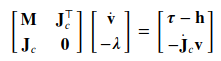
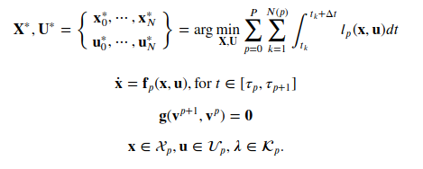
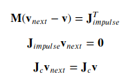

# Trajectory Optimization With Implicit Hard Contacts

Paper Reference: https://ieeexplore.ieee.org/document/8403260

* Use the technique from the paper reference to optimize gait sequence, timing, and whole-body motion by delegating the contact constraints to the system dynamics. 

* The method attempts to incorporate the complementary constraints into the OC problem. This approach is capable of finding dynamic movements without specifying the contact sequence.

#### Goal of this implementation:
* Replace the action model from crocoddyl by the time stepping algorithm used in the reference paper.
* To do that the **DifferentialActionModelContactFwdDynamics** and **IntegratedActionModelEuler** from crocoddyl needs to be reimplemted such that isntead is used the time-stepping algorithm

 

     

#### Multi-Contact dynamics
  Describe the multi-contact dynamics through holonomic constraints for the support legs.

  

* Base on a predefined walking gait build per each phase a specific multi-contact dynamics.
* Describe multi-phase optimal control problem. One can formulate the multi-contact optimal control problem (MCOP) as follows:

  

* g(., ., .) describes the contact dynamics, and they represents terminal constraints in each walking phase. 
* The following impact model is used:

  

