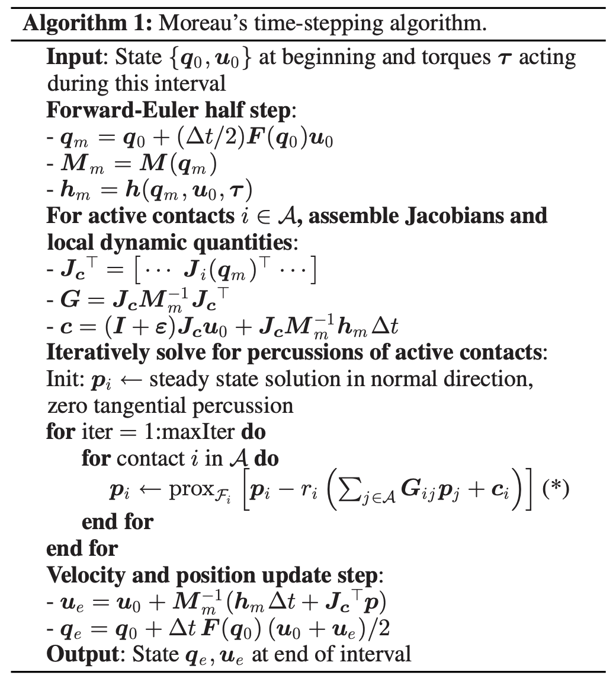

# Trajectory Optimization With Implicit Hard Contacts
<p>
Paper Reference: https://ieeexplore.ieee.org/document/8403260

* Use the technique from the paper reference to optimize gait sequence, timing, and whole-body motion by delegating the contact constraints to the system dynamics. 

* The method attempts to incorporate the complementary constraints into the OC problem. This approach is capable of finding dynamic movements without specifying the contact sequence.

#### Goal of this implementation:
* Replace the action model from crocoddyl by the time stepping algorithm used in the reference paper.
* To do that the **DifferentialActionModelContactFwdDynamics** and **IntegratedActionModelEuler** from crocoddyl needs to be reimplemted such that isntead is used the time-stepping algorithm
```
def create_walking_problem():
  1. Create swing_feep_model()
     * For each fee create a model for the swing phase
     * 
 ```
</p>
 
<p align="center">


</p>     

<p>
## Multi-Contact dynamics
  describe the multi-contact dynamics through holonomic constraints for the support leg.
  


  
</p>

```
 def createFootstepModels(self, comPos0, feetPos0, stepLength, stepHeight, timeStep, numKnots, supportFootIds,
                             swingFootIds):
        """ Action models for a footstep phase.

        :param comPos0, initial CoM position
        :param feetPos0: initial position of the swinging feet
        :param stepLength: step length
        :param stepHeight: step height
        :param timeStep: time step
        :param numKnots: number of knots for the footstep phase
        :param supportFootIds: Ids of the supporting feet
        :param swingFootIds: Ids of the swinging foot
        :return footstep action models
        """
        numLegs = len(supportFootIds) + len(swingFootIds)
        comPercentage = float(len(swingFootIds)) / numLegs

        # Action models for the foot swing
        footSwingModel = []
        for k in range(numKnots):
            swingFootTask = []
            for i, p in zip(swingFootIds, feetPos0):
                # Defining a foot swing task given the step length
                # resKnot = numKnots % 2
                phKnots = numKnots / 2
                if k < phKnots:
                    dp = np.array([stepLength * (k + 1) / numKnots, 0., stepHeight * k / phKnots])
                elif k == phKnots:
                    dp = np.array([stepLength * (k + 1) / numKnots, 0., stepHeight])
                else:
                    dp = np.array(
                        [stepLength * (k + 1) / numKnots, 0., stepHeight * (1 - float(k - phKnots) / phKnots)])
                tref = p + dp

                swingFootTask += [crocoddyl.FramePlacement(i, pinocchio.SE3(np.eye(3), tref))]

            comTask = np.array([stepLength * (k + 1) / numKnots, 0., 0.]) * comPercentage + comPos0
            footSwingModel += [
                self.createSwingFootModel(timeStep, supportFootIds, comTask=comTask, swingFootTask=swingFootTask)
            ]

        # Action model for the foot switch
        footSwitchModel = self.createFootSwitchModel(supportFootIds, swingFootTask)

        # Updating the current foot position for next step
        comPos0 += [stepLength * comPercentage, 0., 0.]
        for p in feetPos0:
            p += [stepLength, 0., 0.]
        return footSwingModel + [footSwitchModel]
        
